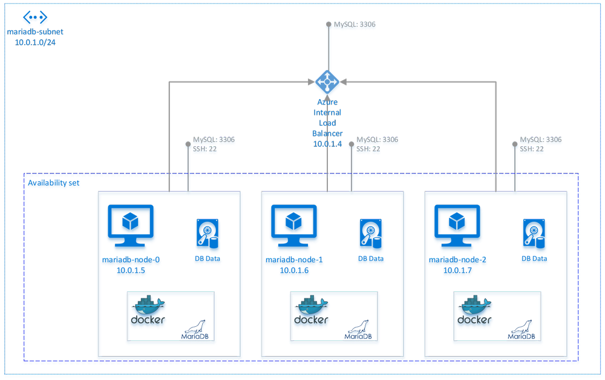

# MariaDB + Galera Cluster on CoreOS with Docker

This repository contains a generator app for the Cloud Config and the Azure Resource Manager (ARM) template files, to create a MariaDB database with Galera Cluster, running inside Docker containers on CoreOS. You can read more about the architecture, and the choices behind it, on [this blog post](http://withblue.ink/2016/03/09/galera-cluster-mariadb-coreos-and-docker-part-1.html). The ARM template is a JSON file that can be deployed automatically with just a few clicks on Azure and it includes a tailored Cloud Config file.

The starting point is the generator app, which is a static HTML file that runs inside any modern web browser to create ad-hoc Cloud Config and Azure ARM template files. In order to use the generator, clone this repository, then open the file `generator.html` with a web browser.

**Please ignore the pre-made `azuredeploy.json` file in this repository, and always generate a new one using the generator app.** The reason why this repository includes `azuredeploy.json` and `azuredeploy.parameters.json` is just for testing with CI.


## Getting started

**Clone this repository in your local machine, then open the `generator.html` file with a web browser.** Using one of the "evergreen browsers" (Edge, Chrome, Safari, Firefox) is recommended. You will need to be connected to the Internet for the web application to work properly.

The web application offers two modes:
- **Azure Resource Manager**: in this mode, an ARM template (a JSON document) is generated, ready to be deployed to Azure. The resulting ARM template includes the Cloud Config file too.
- **Only cloud-config.yaml**: generates only the Cloud Config file, in plaintext and base64-encoded. This file can be used to startup the Galera Cluster on any public/private cloud.

## Deploying to Azure

The ARM template allows you to deploy a MariaDB + Galera Cluster (based on CoreOS) with a few clicks, running on the Microsoft Azure cloud.

### How to deploy the template

1. Ensure you have an active Azure subscription. You can also get a [free trial](http://azure.com/free).
2. Using the `generator.html` page in your machine, create the Azure Resource Manager template, properly configured.
3. Open the [Azure Portal](https://portal.azure.com), then press "+ New" on the top left corner, search for "Template deployment" and select the result with the same name. Then click on the "Create" button.
4. In the "Template" blade, paste the "Azure Resource Manager template" JSON document generated with the HTML app.
5. In the "Parameters" blade, leave all values to their default (the JSON you pasted has all your parameters already hardcoded as default values).
6. Select the subscription you want to deploy the cluster into, then create a new Resource Group (or choose an existing one) and pick in what Azure region you want the deployment to happen. Lastly, accept the mandatory legal terms and press Create.
7. Azure will deploy your VMs and linked resources, and then MariaDB and Galera Cluster will be started in all the VMs automatically. The duration of the setup depends a lot on the size of the attached disks; with small disks (2-4), it should last around 5 minutes.

### Architecture of deployment on Azure

On the Microsoft Azure platform, the JSON template is deploying the following:



1. A Virtual Network named after the Resource Group (not in the diagram) with address space `10.0.0.0/16`.
2. A subnet `10.0.1.0/24` named `mariadb-subnet`.
3. An Azure Internal Load Balancer for the MySQL endpoints (port `3306`). The Internal Load Balancer has always the address `10.0.1.4` and no public IP.
4. The 3 or 5 nodes running the application. All VMs are named `mariadb-node-N` (where N is a number between 0 and 4), with addresses automatically assigned by DHCP (generally, the first one to deploy obtains `10.0.1.5`, and the others follow in sequence). Nodes do not have a public IP, and Network Security Group rules allow traffic to only port `3306` (MySQL) and `22` (SSH), and only from within the Virtual Network. All VMs are also deployed in an Availability Set, in order to achieve high availability.

Your application can connect to the MariaDB Galera Cluster on the IP `10.0.1.4` (Internal Load Balancer) on port `3306`. Using Network Security Group rules, connections to the database are allowed only from within the Virtual Network. Connecting to the cluster using the IP of the Internal Load Balancer is recommended because it handles failover automatically; however, it's still possible to connect to individual nodes directly, for example for debug purposes. In case you need to administer the VMs using SSH, you can do so by connecting to each instance on port `22`, from machines inside the Virtual Network, and authenticating using the public key method.

The default password for the `root` user in the database is **`my-secret-pw`**; it's recommended to change it as soon as possible, using the following SQL statement:

````sql
SET PASSWORD FOR 'root'@'%' = PASSWORD('newpass');
````


## Using the Cloud Config mode

If you use the "Cloud Config mode", the generator app will create only a `cloud-config.yaml` file (in plaintext and base64-encoded). You can use that file to spin up your own cluster, in any public or private cloud.

There are only a few restrictions to keep in mind when designing your architecture:

1. The `cloud-config.yaml` file generated is meant to be used with CoreOS 899+ (latest Stable release as of writing); it has not been tested with any other distribution, and it's likely not to work.
2. Your nodes must be named `mariadb-node-0`, `mariadb-node-1`, etc, up to `mariadb-node-4`. All VMs in the cluster must be able to connect to each other using those names, so you need to ensure that a naming resolution service exists in your infrastructure. Indeed, in the current version, the MariaDB configuration file has hardcoded the hostnames of the VMs; this design choice may change in the future, however.
3. It's strongly advised to use an odd number of nodes to avoid the risk of "split-brain conditions" (please see the [official Galera documentation](http://galeracluster.com/documentation-webpages/weightedquorum.html)).
4. The default password for the `root` user in the database is **`my-secret-pw`**; it's recommended to change it as soon as possible.


## Notes on parameters for the generator

### etcd2 Discovery URL

An optional parameter in the generator app is the Discovery URL for etcd2. etcd2 is a distributed key/value storage that is shipped with CoreOS and on which the deployment scripts in this repository rely on.

**Most users should leave the Discovery URL field empty**. When the field is not set, the generator app will request a new Discovery URL automatically on your behalf, using `http://discovery.etcd.io/`. You will need to manually set a value for this field if you are re-deploying the template in an existing, running cluster.

### SSH key

The generator app requires you to specify a **SSH RSA public key**.

**Linux and Mac** users can use the built-in `ssh-keygen` command line utility, which is pre-installed in OSX and most Linux distributions. Execute the following command, and when prompted save to the default location (`~/.ssh/id_rsa`):

    $ ssh-keygen -t rsa -b 4096

Your **public** key will be located in `~/.ssh/id_rsa.pub`.

**Windows** users can generate compatible keys using PuTTYgen, as shown in [this article](https://winscp.net/eng/docs/ui_puttygen). Please make sure you select "SSH-2 RSA" as type, and use 4096 bits as size for best security.


## For developers

If you want to modify the generator app (for example because you want to alter the deployment scripts, systemd units, etc), you can re-compile it using Grunt.

1. Ensure Node.js 5.0 or higher is installed (it will probably work with Node.js 4.x too, but it's not tested). You can download the latest version from the [Node.js website](https://nodejs.org/).
2. Clone this git repository on your machine: `$ git clone https://github.com/EgoAleSum/mariadb-cluster.git`
3. Inside the directory where you cloned the repository, install the required npm modules: `$ npm install`
4. Rebuild the generator app with: `$ grunt`.
5. To watch for changes to source files and re-compile automatically, you can use `$ grunt watch`.

Structure of the repository:

- The `generator.html` app is built from files in the `sources` folder.
- Inside the source folder, the `cloud-config` directory contains the raw deployment scripts, systemd units and configuration files to be copied on the VMs. Those files are then merged in a single JSON document by Grunt at "compile time". 
- The entry-point for the JavaScript code is the `app.source.js` file. Using Browserify, Grunt merges all JavaScript code into `app.build.js`.
- Lastly, Grunt inlines all JavaScript code inside the `generator.html` file using html-build. Please note that certain third-party dependencies, such as jQuery, Bootstrap and highlight.js, are linked externally (over the Internet).
- Because the `discovery.etcd.io` service doesn't support CORS (see [this issue on GitHub](https://github.com/coreos/discovery.etcd.io/issues/12)), in order for the automatic generation of Discovery URLs to work we need to proxy the request. Without a backend server for the generator app, the best solution is to use a third-party service like [CrossOrigin.me](https://crossorigin.me/). etcd2 Discovery URLs aren't particularly sensitive information, so risks associated with using an external service are minimal. If you're concerned about security, you can deploy your own CORS proxy using the open source CrossOrigin.me code on your own machines, and change the url in the `cloud-config.source.js` file.


## TODO

- [ ] Switch WSREP engine from rsync to xtrabackup (see https://github.com/docker-library/mariadb/pull/47)
- [ ] Enable iptables (see https://www.jimmycuadra.com/posts/securing-coreos-with-iptables/)
